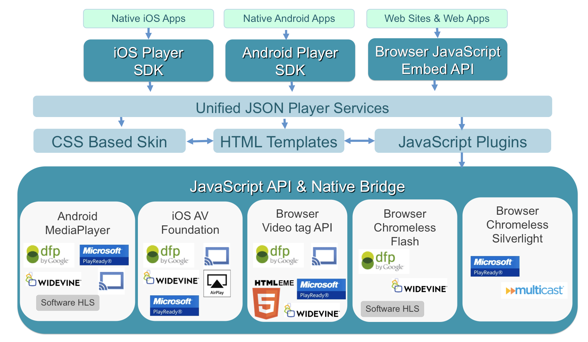
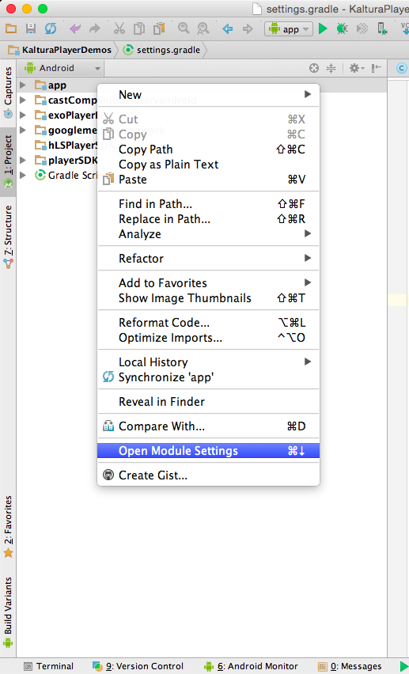
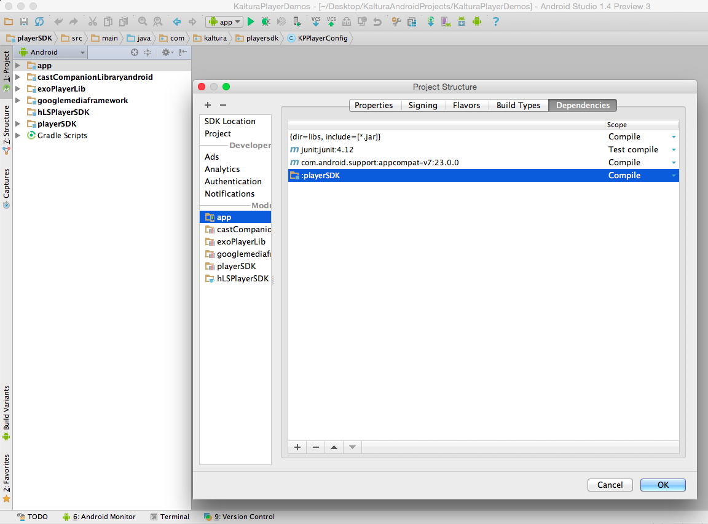

[](https://travis-ci.org/kaltura/player-sdk-native-android)


Player SDK Native Android
=========================

**Note**: The Kaltura native player component is in beta. If your a Kaltura customer please contact your Kaltura customer success manager to help facilitate use of this component.

The Kaltura player-sdk-native component enables embedding the [kaltura player](http://player.kaltura.com) into native environments. This enables full HTML5 player platform, without limitations of HTML5 video tag API in Android platforms. Currently for Android this enables:
* Inline playback with HTML controls ( disable controls during ads etc. )
* Widevine DRM support
* AutoPlay
* Volume Control
* Full [player.kaltura.com](http://player.kaltura.com) feature set for themes and plugins
* HLS Playback
* DFP IMA SDK


For a full list of native embed advantages see native controls table within the [player toolkit basic usage guide](http://knowledge.kaltura.com/kaltura-player-v2-toolkit-theme-skin-guide).

The Kaltura player-sdk-native component can be embedded into both native apps, and hybrid native apps ( via standard dynamic embed syntax )

Future support will include:
* PlayReady DRM
* Multiple stream playback
* Offline viewing

Architecture Overview
=====



Quick Start Guide
======

```
1. git clone https://{username}@bitbucket.org/sukdev/kaltura-android-sdk.git to the same folder of your app.
```
```
2. Add reference to PlayerSDK module from your project:
```

##### Select _`settings.gradle`_ and add:

```
include ':googlemediaframework'
project(':googlemediaframework').projectDir=new File('kaltura-android-sdk/googlemediaframework')

include ':playerSDK'
project(':playerSDK').projectDir=new File('kaltura-android-sdk/playerSDK')

```
##### Right click on your app folder ->_`Open Module Settings`_.



##### Select _`Dependencies`_ tab -> click on the _`+`_ button and choos the _`playerSDK`_ module:


Now, you are linked to the playerSDK by reference. Be sure that you cloned the playerSDK to the same folder of your project.


Make sure that you cloned the **_kaltura-android-sdk_** project to the same folder of your project, if you prefer to clone it else where, you should update the _**`settings.gradle`**_.


Gradle implementation
=====

If you are using Gradle to get libraries into your build, you will need to:

Step 1. Add the StreamAMG maven repository to the list of repositories in Project build.gradle:

```
allprojects {
    repositories {
        ...
        maven {
            url "https://api.bitbucket.org/2.0/repositories/sukdev/kaltura-android-sdk/src/releases"
        }
    }
}
```

Step 2. Add the dependency information in Module app build.gradle:

```
implementation 'com.streamamg:playersdk:2.7.0'
```

If you are not using AndroidX in your app, you should exclude the following module to avoid incompatibilities:

```
implementation 'com.streamamg:playersdk:2.7.0', {
    exclude group: 'androidx.core', module: 'core'
    exclude group: 'androidx.media', module:'media'
}
```


API Overview
=====

### Loading Kaltura player into Fragment - OVP:
```

    public View onCreateView(LayoutInflater inflater, ViewGroup container,
                             Bundle savedInstanceState) {

        // Inflate the layout for this fragment
        if(mFragmentView == null) {
            mFragmentView = inflater.inflate(R.layout.fragment_fullscreen, container, false);
        }

        mPlayerView = (PlayerViewController) mFragmentView.findViewById(R.id.player);
        mPlayerView.loadPlayerIntoActivity(getActivity());

        KPPlayerConfig config = new  KPPlayerConfig("http://{server_mp}", "{uiconf_id}", "{partner_id}");
        config.setEntryId("{entry_id}");
        mPlayerView.initWithConfiguration(config);        mPlayerView.addEventListener(new KPEventListener() {
            @Override
            public void onKPlayerStateChanged(PlayerViewController playerViewController, KPlayerState state) {
                Log.d("KPlayer State Changed", state.toString());
            }

            @Override
            public void onKPlayerPlayheadUpdate(PlayerViewController playerViewController, float currentTime) {
                Log.d("KPlayer State Changed", Float.toString(currentTime));
            }

            @Override
            public void onKPlayerFullScreenToggeled(PlayerViewController playerViewController, boolean isFullscreen) {
                Log.d("KPlayer toggeled", Boolean.toString(isFullscreen));
            }
        });
        return mFragmentView;
    }
```

### Loading Kaltura player into Fragment - OTT:
```

    public View onCreateView(LayoutInflater inflater, ViewGroup container,
                             Bundle savedInstanceState) {

        // Inflate the layout for this fragment
        if(mFragmentView == null) {
            mFragmentView = inflater.inflate(R.layout.fragment_fullscreen, container, false);
        }

        mPlayerView = (PlayerViewController) mFragmentView.findViewById(R.id.player);
        mPlayerView.loadPlayerIntoActivity(getActivity());
        KPPlayerConfig config = null;
        try {
              config = KPPlayerConfig.fromJSONObject(new JSONObject(getConfigJson("123","456","tvpapi_000")));
        } catch (JSONException e) {
              e.printStackTrace();
        }

        mPlayerView.initWithConfiguration(config);        mPlayerView.addEventListener(new KPEventListener() {
            @Override
            public void onKPlayerStateChanged(PlayerViewController playerViewController, KPlayerState state) {
                Log.d("KPlayer State Changed", state.toString());
            }

            @Override
            public void onKPlayerPlayheadUpdate(PlayerViewController playerViewController, float currentTime) {
                Log.d("KPlayer State Changed", Float.toString(currentTime));
            }

            @Override
            public void onKPlayerFullScreenToggeled(PlayerViewController playerViewController, boolean isFullscreen) {
                Log.d("KPlayer toggeled", Boolean.toString(isFullscreen));
            }
        });
        return mFragmentView;
    }

    public String getConfigJson(String mediaID, String uiConfID, String tvpApi) {
     String json = "{\n" +
             "  \"base\": {\n" +
             "    \"server\": \"http://{your_mp}/html5.kaltura/mwEmbed/mwEmbedFrame.php\",\n" +
             "    \"partnerId\": \"\",\n" +
             "    \"uiConfId\": \"" + uiConfID + "\",\n" +
             "    \"entryId\": \"" + mediaID + "\"\n" +
             "  },\n" +
             "  \"extra\": {\n" +
             "    \"controlBarContainer.hover\": true,\n" +
             "    \"controlBarContainer.plugin\": true,\n" +
             "    \n" +
             "    \"liveCore.disableLiveCheck\": true,\n" +
             "    \"tvpapiGetLicensedLinks.plugin\": true,\n" +
             "    \"TVPAPIBaseUrl\": \"http://{tvpapi}/v3_9/gateways/jsonpostgw.aspx?m=\",\n" +
             "    \"proxyData\": {\n";

//        if (Build.VERSION.SDK_INT >= Build.VERSION_CODES.JELLY_BEAN_MR2 /*4.3*/) {
//            json = json + "\"config\": {\n" +
//                    "                                    \"flavorassets\": {\n" +
//                    "                                        \"filters\": {\n" +
//                    "                                            \"include\": {\n" +
//                    "                                                \"Format\": [\n" +
//                    "                                                    \"dash Main\"\n" +
//                    "                                                ]\n" +
//                    "                                            }\n" +
//                    "                                        }\n" +
//                    "                                    }\n" +
//                    "                                },";
//        }
     json = json + "      \"MediaID\": \"" + mediaID + "\",\n" +
             "      \"iMediaID\": \"" + mediaID + "\",\n" +
             "      \"mediaType\": \"0\",\n" +
             "      \"picSize\": \"640x360\",\n" +
             "      \"withDynamic\": \"false\",\n" +
             "      \"initObj\": {\n" +
             "        \"ApiPass\": \"{api_pass}\",\n" +
             "        \"ApiUser\": \"" + tvpApi + "\",\n" +
             "        \"DomainID\": 0,\n" +
             "        \"Locale\": {\n" +
             "            \"LocaleCountry\": \"null\",\n" +
             "            \"LocaleDevice\": \"null\",\n" +
             "            \"LocaleLanguage\": \"null\",\n" +
             "            \"LocaleUserState\": \"Unknown\"\n" +
             "        },\n" +
             "        \"Platform\": \"Cellular\",\n" +
             "        \"SiteGuid\": \"\",\n" +
             "        \"UDID\": \"{udid}\"\n" +
             "      }\n" +
             "    }\n" +
             "  }\n" +
             "}\n";
     return json;
 }
```


### Fetching duration:
For fetching the duration of a video, the player must be in READY state:

```
mPlayerView.addEventListener(new KPEventListener() {
            @Override
            public void onKPlayerStateChanged(PlayerViewController playerViewController, KPlayerState state) {
                Log.d("KPlayer State Changed", state.toString());
                if (state == KPlayerState.READY) {
                    Log.d("Duration", Double.toString(playerViewController.getDurationSec()) );
                }
            }

            @Override
            public void onKPlayerPlayheadUpdate(PlayerViewController playerViewController, float currentTime) {
                Log.d("KPlayer State Changed", Float.toString(currentTime));
            }

            @Override
            public void onKPlayerFullScreenToggeled(PlayerViewController playerViewController, boolean isFullscreen) {
                Log.d("KPlayer toggeled", Boolean.toString(isFullscreen));
            }
        });
```

### DRM license:
For loading the DRM license of a video, the config must have the izsession
izsession is an unique session that client gets after logging in to the website.
Throughout the izsession our service is recognizing if user is allowed to play content or not.


```
String izsession = "00000000-0000-0000-0000-000000000000"; // Replace with your izsession
config.addConfig("izsession", izsession);
```

### Play audio in background:
In order to play audio in background, the activity that uses the PlayerViewController must have the _`onPause()`_ and _`onResume()`_ override methods implemented in this way:

Implementation example:
```
    private boolean backgroundAudioEnabled = true;
    
    @Override
    protected void onPause() {
        if (mPlayer != null && !backgroundAudioEnabled) {
            mPlayer.releaseAndSavePosition(true);
        }
        super.onPause();
    }
    
    @Override
    protected void onResume() {
        if (mPlayer != null && !backgroundAudioEnabled) {
            mPlayer.resumePlayer();
        }
        super.onResume();
    }
```

### AndroidX support:
If your project is not migrated to AndroidX yet, you can still using the SDK changing:

##### In app build.gradle:
```
android {
    compileSdkVersion 28
    ...
    targetSdkVersion 28
    ...
    packagingOptions {
        ...
        exclude 'META-INF/androidx.*'
        exclude 'META-INF/proguard/androidx*'
    }
}

... 

dependencies {
    // change any com.android library version to 28.0.0
    ...
    implementation project(':playerSDK'), {
        exclude group: 'androidx.core', module: 'core'
        exclude group: 'androidx.media', module:'media'
    }
    ...
}
```

##### Error loading the SDK


If you are facing the above issue, you must activate the usesCleartextTraffic option:
In your `AndroidManifest` file add the following line in your `application` tag
```
android:usesCleartextTraffic="true"
```